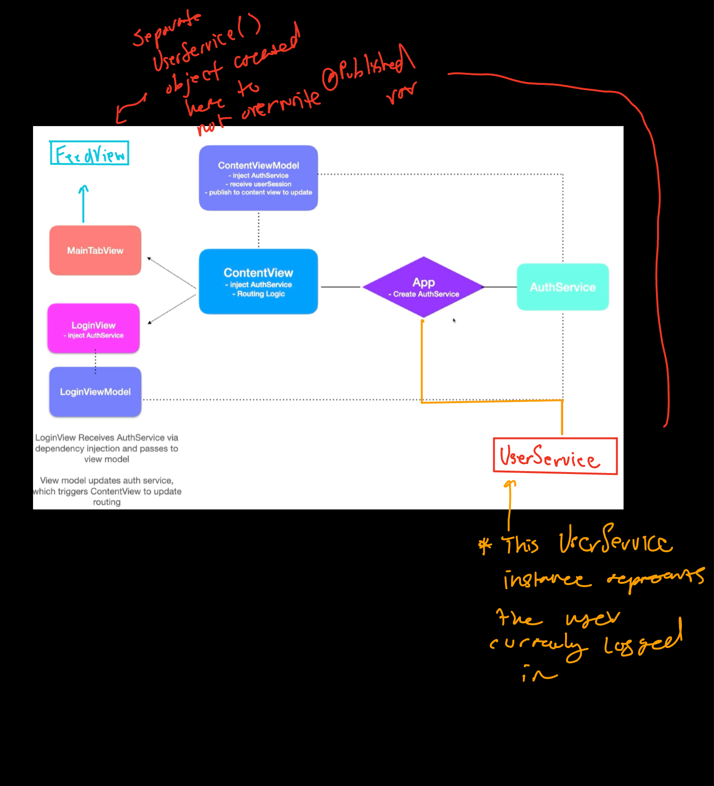

#  Tik Tok Tutorial Project

### Project Progress
Essential Features: (85%)

## API Layer - Managed Backend with Firebase
### Implementation Details
We created a one to one association between our service and model layer to isolate data fetching needs as much as possible.

 

Pattern:

Found these custom #pragma marks thru stackoverflow [thread](https://stackoverflow.com/questions/6662395/xcode-intellisense-meaning-of-letters-in-colored-boxes-like-f-t-c-m-p-c-k-etc) (also explains xcode's icon labeling with code sense)
    
### View Components 
- [x] FeedView
- [x] NotificationsView
- [x] CurrentUserProfileView
- [x] UserProfileView
- [x] LoginView
- [x] RegistrationView
- [x] UploadView
- [ ] FollowingView
- [ ] FollowersView

 

### View Models
- [x] FeedViewModel
- [x] ProfileHeaderViewModel            (for user @Published Property)
- [x] PostGridViewModel                 (for posts @Published Property)
- [x] ContentViewModel                  (for userSession @Published Property)
- [x] ExploreViewModel                  (for userList @Published Property)
- [ ] FollowingViewModel
- [ ] FollowersViewModel

 

### Data Models
- [x] User
- [x] Post
- [] Following
- [] Followers

 

### Future feature updates
- [x] Develop video player functionality to play uploaded/shared content
- [x] Develop Firebase authentication scheme
- [x] Develop Routing Logic and manage Firebase session securely
- [x] Develop Service layer to interact with collections within Firebase
- [ ] Firestore storage for user posts (TESTING)
